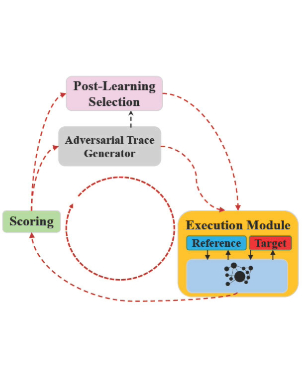
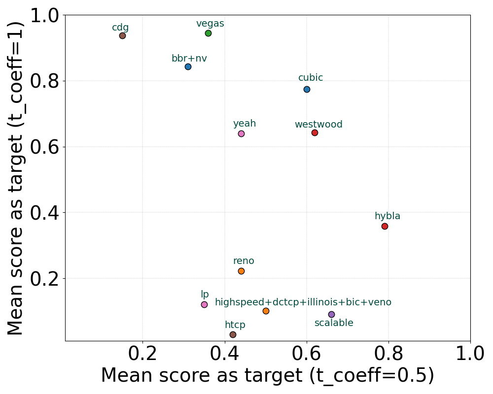

# AdvNet

**Revealing performance issues in network protocols by generating adversarial environments.**

[](https://doi.org/10.1145/3808660)
[](https://doi.org/10.1145/3808660)
[](https://arxiv.org/abs/2605.00755)
[](LICENSE)
[](requirements.txt)

<p align="center">
  
</p>

## Overview

Congestion-control (CC) algorithms are expected to deliver good performance across the
enormous diversity of real Internet conditions — but testing them by hand only covers the
scenarios a human thinks to try. **AdvNet** automatically *generates* the network
environments that make a protocol look bad. It frames "find a hard environment" as an
optimization problem and uses machine-learning-based search to evolve time-varying link
traces (bandwidth, latency, queue size) that maximize the performance gap between a
**target** protocol and a **reference**, with a built-in noise-handling mechanism to keep
the search reliable on a noisy emulator.

As shown in the figure above, AdvNet runs a closed loop: an **Adversarial Trace Generator**
proposes a trace, an **Execution Module** emulates it for both the reference and the target,
a **Scoring** component turns the result into an adversarial score, and a **Post-Learning
Selection** stage picks the strongest discovered traces. Applied to the Linux kernel, AdvNet
surfaced previously unnoticed CC bugs and hidden limitations across many implementations.

## Key findings (§4.3 — Comparison of TCP Protocols)

AdvNet was used to run **pairwise robustness comparisons of all 17 TCP congestion-control
algorithms in the Linux kernel** (2-hour search budget per pair; the final 10% of the time
reserved for the post-learning selection phase):

- **Every protocol is vulnerable** — each one suffers a large performance drop under some
  adversarial environment that AdvNet discovers.
- **Vulnerability discovery is reference-dependent** — which environments expose a weakness
  depends strongly on the reference protocol (e.g. with `bbr` as reference at `tcoeff=0.5`,
  6 of 16 protocols produce a large positive score).
- **`cdg` is the most robust** when balancing high throughput against low latency; **`lp`**
  and **`htcp`** are preferable when latency is ignored.
- The ranking is highly sensitive to the throughput-vs-latency weighting `tcoeff`. At
  `tcoeff=1` (zero weight on latency) a specific **`bbr`** bug (§4.4.1) pushes every
  `bbr`-as-target scenario above **0.8**, and delay-based **`vegas`** scores above **0.9**.

<p align="center">
  
</p>

<p align="center">
  <em>Mean adversarial score of each protocol <strong>as the target</strong> under
  <code>tcoeff=0.5</code> (x-axis) vs <code>tcoeff=1</code> (y-axis). Lower is more robust.</em>
</p>

See the [paper](https://doi.org/10.1145/3808660) for the full pairwise heatmaps and analysis.

## Repository structure

| Path | Description |
| --- | --- |
| `search_adv_traces.py` | Main entry point; dispatches a domain (`--type`) and a search algorithm (`--alg`). |
| `GA/` | Genetic-algorithm search (`ga.py`, `problem.py`, `mutation.py`). |
| `random_generator/` | Uniform random-search baseline (RG). |
| `BO/`, `BL/` | Bayesian-optimization and epsilon-greedy baseline searchers. |
| `RL/` | Reinforcement-learning agents and environments. |
| `scoring/` | Adversarial scoring of reference-vs-target performance. |
| `NoiseHandler/` | Noise-handling mechanism for reliable evaluation. |
| `Simplify/` | Simplifies discovered traces into interpretable patterns. |
| `ns3_tcp/` | ns-3 evaluation backend for Linux TCP. |
| `single_cc/`, `mptcp/`, `picoquic/`, `dchannel/`, `multiflow/` | Emulation backends for single-flow CC, MPTCP, QUIC, data channels, and multi-flow setups. |
| `utils/`, `selection_simulator/` | Helpers and the post-learning selection simulator. |
| `patterns/`, `results/`, `Plots/` | Extracted patterns, search logs, and figures/plotting scripts. |

## Installation

```bash
pip install -r requirements.txt
```

AdvNet drives a network emulator and (for the ns-3 backend) an ns-3 build:

- **ns-3 backend**: point AdvNet at your ns-3 source tree via an environment variable:
  ```bash
  export ADVNET_NS3_PATH=/path/to/ns-3-dev
  ```
- **Local configuration**: copy `config.example.py` to `config.py` (gitignored) and adjust.
- **Modified Mahimahi**: the emulation backends use a modified Mahimahi that supports
  time-varying latency and extra logging:
  [Modified Mahimahi (delay-trace branch)](https://github.com/Dariwala/mahimahi-cdn/tree/delay-trace).

## Usage

```bash
python search_adv_traces.py [arguments]
```

| Argument | Description |
| --- | --- |
| `--type` | Integer id of the evaluation domain (each `args.type` block in `search_adv_traces.py`). |
| `--alg` | Search algorithm: `0` = Random Generation (RG), `1` = Genetic Algorithm (GA). |
| `--trace_length` | Number of dimensions in the trace to search. |
| `--l_bounds` / `--u_bounds` | Per-dimension lower/upper bounds (space-separated). |
| `--seed` | Random seed for reproducibility. |
| `--total_time` | Total search time, in seconds. |
| `--initial_pop_file` | Optional file with an initial population of traces. |

### Example

```bash
python search_adv_traces.py \
    --type=1 \
    --alg=1 \
    --trace_length=5 \
    --l_bounds 1 1 1 1 1 \
    --u_bounds 10 10 10 10 10 \
    --seed=42 \
    --total_time=3600
```

## Adding a new domain

AdvNet is extensible to new protocols/environments. To add a domain:

1. Add a new `if args.type == NEW_TYPE:` block in `search_adv_traces.py` that configures the
   algorithm and instantiates `CCProblem` with your parameters.
2. Implement an **evaluation function** that takes a trace (a 1-D array of integers) plus any
   extra parameters and returns a scalar score. Extra parameters are passed positionally when
   constructing `CCProblem` and forwarded to your function via `*args`.
3. Add a matching `if self.type == NEW_TYPE:` case in `GA/problem.py::_evaluate` that calls
   your evaluation function.
4. Use `update_max_score(...)` to record improvements to the best trace, and `log(...)` to
   record every evaluated trace.

## Citation

If you use AdvNet, please cite the published version:

```bibtex
@article{ahmed2026advnet,
  title     = {AdvNet: Revealing Performance Issues in Network Protocols by Generating Adversarial Environments},
  author    = {Ahmed, Shehab Sarar and Sentosa, William and Zhang, Yinjie and Lebendiker, Yoav and Shnaiderman, Mickey and Gilad, Tomer and Jay, Nathan H. and Godfrey, Brighten and Schapira, Michael},
  journal   = {Proceedings of the ACM on Networking (PACMNET)},
  volume    = {4},
  number    = {CoNEXT2},
  pages     = {1--22},
  year      = {2026},
  publisher = {Association for Computing Machinery},
  doi       = {10.1145/3808660}
}
```

Published in *Proceedings of the ACM on Networking* (CoNEXT 2026) ·
[DOI](https://doi.org/10.1145/3808660) · [arXiv preprint](https://arxiv.org/abs/2605.00755).

## License

Released under the [MIT License](LICENSE).
